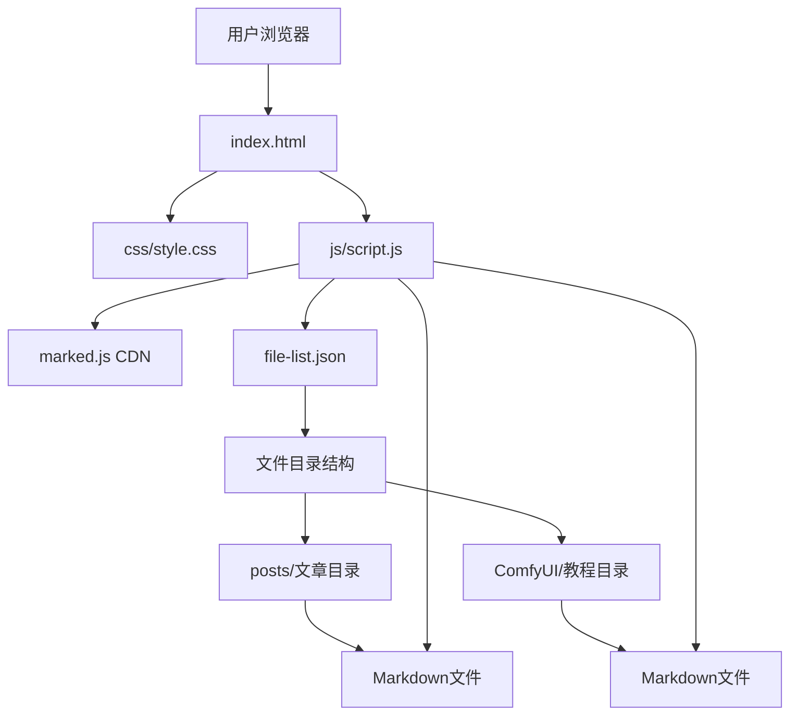

# 项目结构文档 (Structure.md)

## 1. 项目概述

这是一个基于纯前端技术（HTML, CSS, JavaScript）构建的个人博客系统，可以直接托管在 GitHub Pages 上。它能够动态地加载和展示项目中的 Markdown 文件，无需后端支持。

### 1.1 项目特点

- **无后端依赖**：纯静态页面，完全基于前端技术实现
- **动态内容加载**：通过 `file-list.json` 动态生成文件目录，实时展示博客文章
- **Markdown 支持**：使用 marked.js 解析和渲染 Markdown 格式文档
- **响应式布局**：适配不同屏幕尺寸，提供良好的移动端体验
- **自动化脚本**：提供 Python 脚本简化文章添加和发布流程

### 1.2 技术栈

- **前端技术**：HTML5, CSS3, JavaScript (ES6+)
- **Markdown 解析**：marked.js
- **自动化工具**：Python 3.x 脚本
- **版本控制**：Git
- **部署平台**：GitHub Pages

## 2. 技术架构



### 2.1 前端架构

1. **入口文件**：`index.html` 作为主页面，包含基本的 HTML 结构
2. **样式文件**：`css/style.css` 负责页面样式和响应式布局
3. **脚本文件**：`js/script.js` 实现动态内容加载和交互功能
4. **外部依赖**：通过 CDN 引入 marked.js 用于 Markdown 解析

### 2.2 数据流

1. 页面加载时，JavaScript 从 `file-list.json` 获取文件目录结构
2. 用户点击目录中的文章链接时，通过 AJAX 请求获取对应的 Markdown 文件内容
3. 使用 marked.js 将 Markdown 内容解析为 HTML 并显示在页面上

## 3. 目录结构说明

```
项目根目录/
├── index.html                 # 网站入口文件
├── file-list.json             # 文件目录结构定义
├── README.md                  # 项目说明文档
├── Structure.md               # 项目结构文档（当前文件）
├── css/
│   └── style.css              # 样式文件
├── js/
│   └── script.js              # 主要JavaScript逻辑
├── posts/                     # 博客文章目录
│   └── welcome.md             # 示例文章
├── ComfyUI/                   # ComfyUI教程目录
│   ├── flux-kontext 教程.md    # Flux教程
│   └── Wan2.2-5B 教程.md      # Wan教程
└── scripts/                   # 自动化脚本目录
    ├── add_post.py            # 添加文章脚本
    ├── publish.py             # 发布脚本
    └── generate_file_list.py  # 生成文件列表脚本
```

## 4. 核心功能实现

### 4.1 动态目录生成

通过 `js/script.js` 中的 `buildTree` 函数递归构建文件目录的 HTML 结构，支持文件夹和文件的展示。

### 4.2 Markdown 内容渲染

使用 marked.js 库将 Markdown 格式的文档解析为 HTML，并应用自定义样式进行展示。

### 4.3 响应式设计

通过 CSS 媒体查询和 Flexbox 布局实现响应式设计，适配不同屏幕尺寸。

## 5. 自动化脚本

项目提供了三个 Python 脚本以简化博客管理：

### 5.1 add_post.py

用于添加新文章的脚本，主要功能包括：
- 图形化文件选择
- 自动复制文件到指定目录
- 自动更新 `file-list.json`

### 5.2 publish.py

用于发布更改到 GitHub 的脚本，自动化执行：
- `git add .`
- `git commit -m "提交信息"`
- `git push`

### 5.3 generate_file_list.py

用于重新生成 `file-list.json` 的脚本，扫描项目目录并构建文件结构。

### 5.4 delete_post.py

用于可视化删除指定博客文章的脚本，主要功能包括：
- 图形化展示现有博客文章列表
- 支持选择单篇或多篇博客进行删除
- 自动删除文件并更新 `file-list.json`

### 5.5 move_post.py

用于可视化修改指定博客文章文件位置的脚本，主要功能包括：
- 图形化展示现有博客文章列表
- 支持选择单篇博客进行移动
- 允许指定新的目标目录
- 自动移动文件并更新 `file-list.json`

## 6. 文件管理机制

### 6.1 file-list.json 结构

该文件是博客系统的核心数据文件，定义了网站的目录结构：

```json
[
  {
    "type": "folder",
    "name": "目录名",
    "children": [
      {
        "type": "file",
        "name": "文件显示名称.md",
        "path": "相对于根目录的完整路径/文件名.md"
      }
    ]
  }
]
```

### 6.2 文章管理

建议将所有博客文章存放在 `posts` 目录下，便于管理和维护。

### 6.3 ComfyUI教程内容

项目中包含ComfyUI相关的教程文档，主要介绍：
- Flux模型的使用方法
- Wan模型的使用方法
- 相关模型文件的下载和存储位置

## 7. 部署和发布流程

### 7.1 手动部署

1. 将所有更改提交到 GitHub 仓库
2. GitHub Pages 会自动重新构建网站
3. 几分钟后新内容即可在线访问

### 7.2 自动化发布

使用 `scripts/publish.py` 脚本可以自动化执行发布流程。


## 8. 扩展和维护

### 8.1 添加新文章

可以通过以下两种方式添加新文章：
1. 使用 `add_post.py` 自动化脚本（推荐）
2. 手动创建 Markdown 文件并更新 `file-list.json`

### 8.2 样式定制

可以通过修改 `css/style.css` 文件来自定义网站样式。

### 8.3 功能扩展

可以通过修改 `js/script.js` 文件来扩展网站功能。